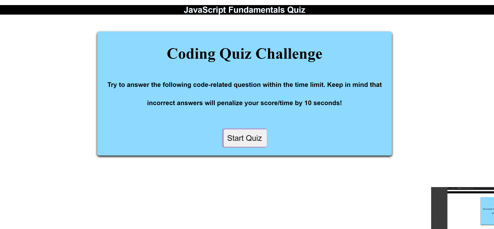

# JavaQuiz-Challenge
Prove your JavaScript Knowledge

This html was created as a way to review basic knowledge of JavaScript in a form of a timed quiz.

You are given 60 seconds to finish and for every wrong answer, the counter gets down 10 sec.
You can select your answer by clicking the option you want, and after you are done, you can save your score by entering your name and clicking the button.

If you dont want to see the previous scores, you can clear them by pressing the "Clear Name" button.

To run the application you just need to open the URL:

